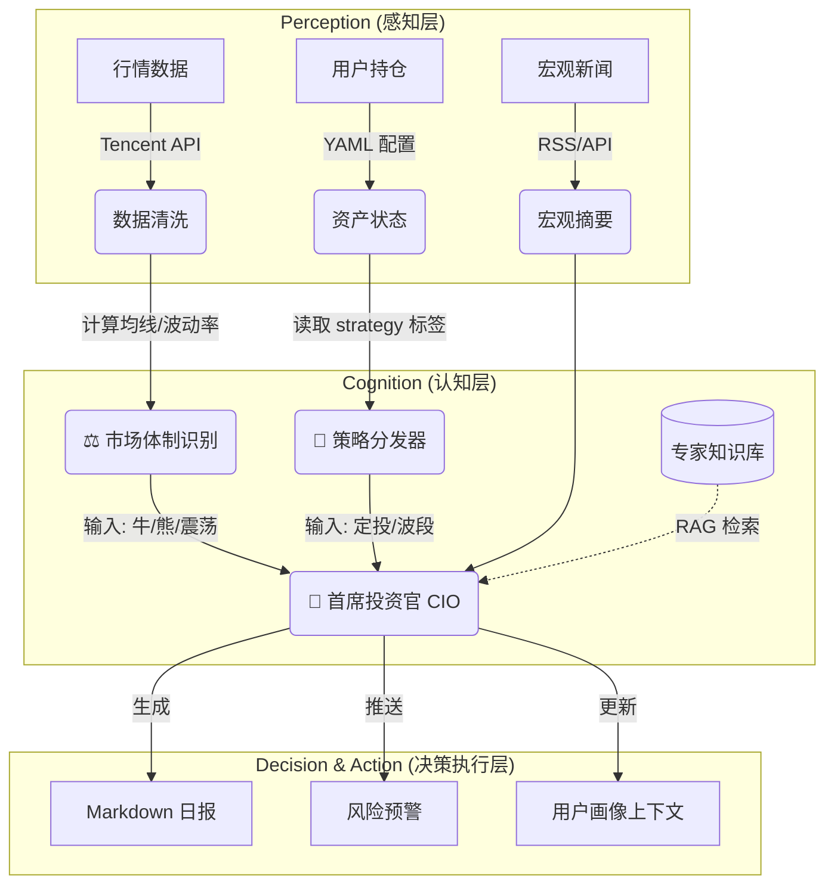

# 🚀 Agentic Investment OS (v2.0)

> "An AI Investment Advisor that knows your intent, adapts to the market, and protects your wealth."

## 📖 项目简介

**Agentic Investment OS** 是一个高度私人化的智能投资辅助系统。与传统的量化脚本或通用 AI 聊天机器人不同，本系统具备 **“意图感知 (Intent-Aware)”** 和 **“体制识别 (Regime-Adaptive)”** 能力。

它不仅能分析大盘，还能根据你对不同资产设定的战略（如“长线定投”或“短线博弈”），结合当前的市场环境（牛/熊/震荡），给出**分层级、个性化**的操作建议。

## 🏗️ 系统架构 (v2.0)



## 🌟 核心特性 (v2.0)

1.  **个性化持仓诊断 (Personalized Diagnosis)**
    *   读取 `portfolio.yaml`，不仅计算盈亏，更根据**资产意图**（定投 vs 短线）给出建议。
    *   *例子：* 对于“定投”资产，下跌是买入机会；对于“短线”资产，下跌是止损信号。

2.  **动态市场体制识别 (Dynamic Regime Detection)**
    *   系统自动判断当前处于 **牛市 (Bull)**、**熊市 (Bear)** 还是 **震荡市 (Chop)**。
    *   AI 的“性格”会随市场变化：牛市激进进攻，熊市极度防御。

3.  **专家逻辑复刻 (Expert Logic Distillation)**
    *   通过 RAG 技术，系统内置了资深投资专家的思维模型，在分析时会自动引用历史案例和逻辑准则。

4.  **自动化工作流**
    *   每日收盘自动运行 -> 抓取数据 -> 模拟/真实新闻分析 -> 生成 Obsidain 格式日报。

## 🛠️ 目录结构

```text
Agentic-Investment-OS/
├── config/
│   ├── portfolio.yaml      # [核心] 持仓与策略配置文件
│   └── settings.yaml       # API Key 配置
├── data/                   # 本地数据缓存
├── reports/                # 生成的 Markdown 日报
├── src/
│   ├── core/               # [大脑]
│   │   ├── advisor.py      # LLM 交互与 Prompt 构建
│   │   └── regime.py       # [New] 市场体制判断逻辑
│   ├── tools/              # [手脚]
│   │   ├── market_data.py  # 行情抓取
│   │   ├── news_hub.py     # [New] 新闻聚合
│   │   └── portfolio_mgr.py# 资产计算
│   └── utils/              # 辅助工具
├── main.py                 # 启动入口
└── requirements.txt
```

## ⚙️ 配置示例 (`portfolio.yaml`)

```yaml
cash: 50000
holdings:
  - name: "恒生科技ETF"
    code: "sh513130"
    cost: 0.800
    shares: 2000
    strategy: "dca"   # 关键：dca(定投) / swing(波段)
    term: "long"      # long(长线) / short(短线)
```

## 🛠️ 技术栈

- 核心语言: Python 3.9
- 大模型支持: OpenAI / DeepSeek / Claude (via API)
- 数据源: AkShare (开源财经数据接口)
- 知识库/前端: Obsidian (Markdown + Dataview)
- 调度: GitHub Actions / Local Cron


## 🚀 快速开始

1. 克隆仓库
2. 安装依赖: pip install -r requirements.txt
3. 配置 config/settings.yaml (填入 API Key)
4. 运行: python main.py

## 📄 License
MIT
