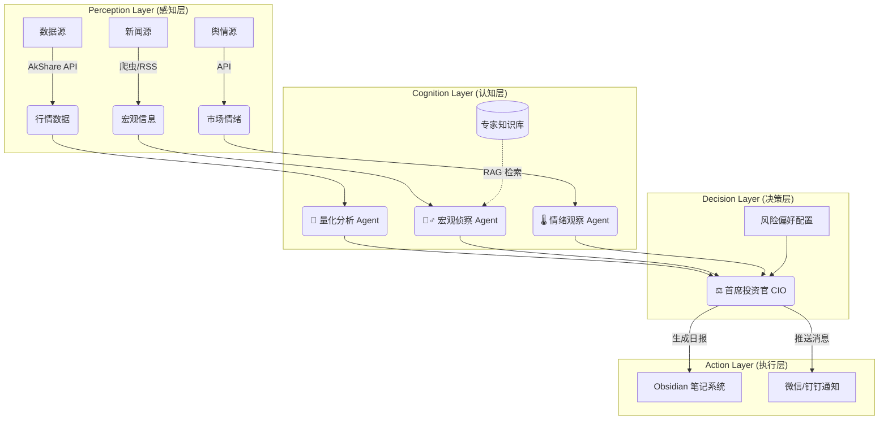

# 🚀 Agentic Investment OS (AI 投资辅助系统)

> "Invest in logic, not just intuition."

## 📖 项目简介

**Agentic Investment OS** 是一个基于 **LLM (大语言模型)** 与 **Python 量化数据** 的自动化投资辅助系统。它旨在通过多智能体协作（Multi-Agent Collaboration），结合权威宏观信息与实时市场数据，为个人投资者提供理性、可回溯的投资决策支持。

本项目采用 **“感知-认知-决策”** 分层架构，模拟专业投资委员会的运作流程。

## 🏗️ 系统架构

## 🛠️ 技术栈

- 核心语言: Python 3.10+
- 大模型支持: OpenAI / DeepSeek / Claude (via API)
- 数据源: AkShare (开源财经数据接口)
- 知识库/前端: Obsidian (Markdown + Dataview)
- 调度: GitHub Actions / Local Cron

## 🚀 快速开始

1. 克隆仓库
2. 安装依赖: pip install -r requirements.txt
3. 配置 config/settings.yaml (填入 API Key)
4. 运行: python main.py

## 📄 License

MIT