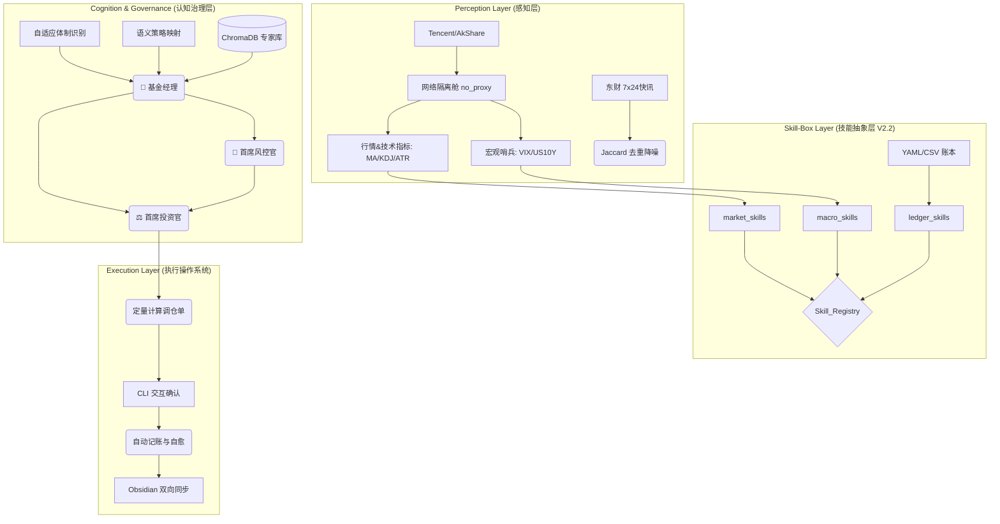

# 🚀 Agentic Investment OS 

[](https://www.python.org/downloads/)
[]()
[]()
[]()
[](https://opensource.org/licenses/MIT)

> "An Autonomous Investment Operating System with Multi-Agent Debate, Adaptive Regime Detection, and Local RAG Memory."
> 
> **不仅是量化脚本，更是懂你投资哲学的私人硅基对冲基金。**

---

## 项目简介 (Overview)

**Agentic Investment OS** 是一个高度私人化、自适应的智能投资辅助系统。

针对传统量化死板、大模型容易产生“幻觉”的痛点，本系统首创了 **“三权分立治理模型 (Triad Governance)”** 与 **“状态真理协议 (State Truth Protocol)”**。系统能够通过自然语言读取用户的投资哲学，将其动态映射为量化因子，结合全球宏观哨兵数据，由多智能体进行激烈的红蓝对抗辩论，最终输出精确到“股”的定量调仓指令，并自动与用户的 Obsidian 知识库实现闭环同步。

目前系统已完成 **V2.2 技能库架构 (Skill-Box Architecture)** 重构，所有底层能力已封装为原子化接口，全面为 V3.0 (接入 OpenClaw/ReAct 自主智能体) 做好准备。

---

## 核心特性 (Core Highlights)

### 🧠 1. 多智能体三权分立决策 (Triad Decision Engine)
- **👨‍💼 基金经理 (Advisor)**：主打进攻。基于核心-卫星策略，在合理估值内寻找动量与趋势机会。
- **🛑 首席风控官 (Risk Officer)**：主打防守（红军）。使用 KDJ超买、ATR异常波动、美债收益率飙升等宏观红线，对 Advisor 提出无情反驳与一票否决。
- **⚖️ 首席投资官 (CIO)**：终审仲裁。权衡红蓝双方观点，输出最终可执行的 JSON 调仓指令。

### 🌍 2. 全维宏观哨兵与自适应体制 (Adaptive Regime & Macro Moat)
- **全球视野**：不仅监控 A/港/美股 与场外基金，更内置了 `USD/CNH (离岸人民币)`、`US10Y (美债)`、`VIX (恐慌指数)` 及 `黄金锚点` 的宏观哨兵矩阵。
- **自适应体制识别**：摒弃死板的 MA200 牛熊判定。引入 **ATR 波动率归一化** 与 **MA60 防御线**，动态识别 `Aggressive Bull`, `Correction`, `Panic` 等 6 种微观气候。

### 🧬 3. 语义策略映射与动态猎人 (Semantic-to-Quant Hunter)
- **投资哲学注入**：用户在 YAML 中用自然语言写下投资原则，系统通过 `PolicyTranslator` 自动将其映射为量化因子权重（如：动量 0.6，红利 0.4）。
- **Tencent Chunking 选股引擎**：8秒内完成 5000+ 标的横截面扫描，结合本地 **ChromaDB 向量知识库 (RAG)** 中的大师研报，主动捕获潜在 Alpha。

### 🔗 4. 零幻觉闭环与 Obsidian 操作系统 (Zero-Hallucination OS)
- **账本自愈**：强制确立 YAML 与 CSV 为系统绝对真理，彻底消灭大模型的“仓位幻觉”。
- **数学与逻辑合流**：`Rebalancer` 引擎自动计算标的偏离度，执行动态定投 (Dynamic DCA)，防止接飞刀。
- **知识库同步**：CLI 终端一键确认调仓 (`/buy`, `/sell`)，系统自动扣减现金、计算加权成本，并将每日行研简报与交易快照生成 Markdown 无缝推送到 **Obsidian** 本地金库。

---

## 目录结构(Context)

```text
Agentic-Investment-OS/
├── config/                 # 核心配置矩阵
│   ├── portfolio.yaml      # [状态真理] 用户持仓、资金与微观策略标签
│   ├── strategy_profile.yaml # [投资哲学] 核心-卫星量化权重与风控红线
│   └── settings.yaml       # API Keys, 代理配置与 Obsidian 路径
├── data/                   # 本地持久化数据
│   ├── trade_history.csv   # 交易流水日志 (审计与复盘依据)
│   ├── nav_history.csv     # 账户净值曲线追踪
│   ├── long_term_memory.json # 跨日多智能体共识记忆
│   └── expert_kb/          # ChromaDB 本地向量数据库目录
├── reports/                # 生成的 Markdown 日报缓存
├── src/
│   ├── core/               # 🧠 硅基大脑与多智能体治理层
│   │   ├── advisor.py      # 基金经理 (主攻: 趋势与估值)
│   │   ├── risk_officer.py # 首席风控官 (主防: 挑刺与宏观压制)
│   │   ├── cio.py          # 首席投资官 (仲裁与 JSON 指令生成)
│   │   ├── regime.py       # 自适应体制识别 (ATR波动率 + MA60防线)
│   │   ├── memory.py       # 长短期上下文记忆引擎
│   │   ├── strategy_parser.py # 语义映射 (自然语言 -> 因子权重)
│   │   └── knowledge_base.py  # 本地 RAG 向量检索引擎 (ChromaDB)
│   ├── tools/              # 🧰 原子化技能箱 (Skill-Box V2.2)
│   │   ├── skill_registry.py  # 技能注册中心 (供 ReAct 发现工具)
│   │   ├── market_skills.py   # 行情、量价与技术指标技能
│   │   ├── macro_skills.py    # 估值与宏观哨兵 (VIX/汇率/美债)技能
│   │   ├── ledger_skills.py   # 账本查询、虚拟交易与复盘技能
│   │   ├── market_hunter.py   # 双层漏斗动态选股猎人
│   │   └── rebalancer.py      # 动态定投与权重偏离调仓引擎
│   └── utils/              # ⚙️ 基础设施
│   │   ├── network.py      # 代理隔离舱 (解决境内外网络死锁)
│   │   ├── report_gen.py   # 宏微观双表 Markdown 渲染
│   │   └── obsidian_sync.py# 知识库双向同步与交易单生成
├── main.py                 # 🚀 系统主入口与 CLI 交互终端
└── requirements.txt        # 依赖清单
```

---

## 系统架构图 (Architecture Diagram)



---

## 🛠️ 工程哲学与硬核设计 (Engineering Philosophy)

本项目在开发过程中克服了多个典型的量化系统工程痛点：

1. **代理悖论 (The Proxy Paradox)**：国内金融数据 API 需直连，而 LLM 需走代理。本项目采用 `@no_proxy_context` Monkey Patch 隔离舱，在极短的请求生命周期内切断系统代理，实现了网络层面的 100% 零污染隔离。
2. **轻量化技能栈 (Zero-MCP)**：为适配未来的 ReAct 自主 Agent，本系统未使用臃肿的 LangChain 或 MCP 协议，而是采用“语义即文档”的原生 Python 函数封装。
3. **状态真理协议 (State Truth Protocol)**：AI 的短板在于记忆。本系统剥夺了 AI 对仓位的“回忆权”，强行将 `portfolio.yaml` 作为绝对只读真理注入上下文，实现了 0 股资产自动剔除与账本自愈。

---

## 📦 快速开始 (Quick Start)

### 1. 环境准备
```bash
git clone https://github.com/yourusername/Agentic-Investment-OS.git
cd Agentic-Investment-OS
pip install -r requirements.txt
```

### 2. 核心配置
请在 `config/` 目录下完成两项核心配置：
*   **`settings.yaml`**: 填入你的 DeepSeek / OpenAI API Key，以及本地 Obsidian 库路径。

```yaml
# config/settings.yaml
api_key: "sk-************"
base_url: ""

# Obsidian 知识库根目录绝对路径 (请确保路径正确，Windows建议用双斜杠或正斜杠)
obsidian_vault_root: ""

# 策略说明：
# 1. AkShare (数据层): 代码强制直连，不受此配置影响，也不受系统代理影响。
# 2. LLM (决策层): 将使用此处的配置。
proxy:
  # 如果 DeepSeek 直连卡顿，可改为 true 并填写地址；
  # 如果电脑开了全局代理但 DeepSeek 是国内站，建议设为 false，代码会强制绕过系统代理。
  llm_use_proxy: false 
  http_url: "http://127.0.0.1:7890" 
  https_url: "http://127.0.0.1:7890"
```

 
*   **`strategy_profile.yaml`**: 写下你的自然语言投资哲学，配置核心/卫星仓位的容忍偏离度。
  
```yaml
# config/strategy_profile.yaml
investment_philosophy: >
  我是一位风险厌恶型的长期投资者，核心资产配置追求长期复利，卫星资产追求短期弹性。
  交易准则：左侧埋伏右侧加，破位纪律定止损。
  对于核心资产，可以采用长线定投，左侧策略，接受短期的回撤；
  对于卫星资产，追求短期的波段收益，右侧策略，必须严格执行止损纪律。
  决策前提：必须结合估值安全边际（PE/PB）和市场环境（体制）。
  对于长线标的：跌幅即机会；对于短线博弈标的：保本即天职。

portfolio_structure:
  core_weight: 0.70
  satellite_weight: 0.30
  execution_mode: "confirm" # 可选: "auto" (自动触发下单), "confirm" (仅打印建议等待确认)

dynamic_strategies:
  core_dca:
    target_tags: ["纳斯达克", "高股息红利", "黄金"]
    factors:
      pe_quantile: -0.8    # 越低越好，权重 0.8
      dividend_yield: 0.5  # 越高越好，权重 0.5
      volatility: 0.2      # 越低越好，权重 0.2
      
  satellite_momentum:
    target_tags: ["科技主题", "热点行业"]
    factors:
      momentum_slope: 0.6  # 斜率越陡越好
      volume_ratio: 0.3    # 放量越明显越好
      kdj_signal: 0.1      # 是否金叉
      
risk_governance:
  max_drawdown_limit: 0.10
  us10y_yield_threshold: 4.0
  valuation_hard_stop: 0.85

rebalance_rules:
  # 资产映射关系
  category_mapping:
    core: ["long"]               # term 为 long 的划入核心仓
    satellite: ["mid", "short"]  # term 为 mid/short 的划入卫星仓
  
  # 容忍度阈值
  tolerance_threshold: 0.05      # 偏离目标权重 5% 以内不进行全量调仓 (避免频繁交易)
  
  # 动态定投 (DCA) 参数
  dca_build_period: 60           # 默认建仓期：60个交易日 (约3个月)
  dca_dynamic_adjust: true       # 开启基于技术指标的动态调整
```
*   **`portfolio.yaml`**: 配置你的初始资金与关注标的（支持 A股/港股/美股ETF/场外基金/黄金）。
  
```yaml   
# 用户持仓配置

# 当前可用现金 (人民币)
cash: 7000

# 持仓列表
# symbol 必须与 market_data.py 中的代码格式一致 (如 sh000300)
# strategy 选项: dca (定投) | value (价值) | swing (波段)
# term 选项: short (短线) | mid (中线) | long (长线)
# track_index 告诉AI这个标的的跟踪指数。个股无需填写，ETF则填写对应的指数代码（如 sh513130 跟踪 987008 恒生科技指数）
holdings:
  - name: "恒生科技ETF"
    symbol: "sh513130"
    cost: 1.00    # 持仓成本价
    shares: 10000       # 持仓份额/股数
    strategy: "value"   # 定投策略
    term: "long"      # 长线持有
    track_index: "H30533"    # 跟踪指数：恒生科技指数
    reason: "看好港股科技板块超跌后的估值修复，作为底仓配置"
    
```

### 3. 运行与交互
```bash
python main.py
```
*系统将在 16:30 后自动抓取清算数据，进行红蓝军对抗，并在终端输出调仓指令表。通过敲击 `y` 即可一键更新账本并生成 Obsidian 交易快照。*


---

## ⚠️ 免责声明 (Disclaimer)
本项目仅供计算机科学、人工智能与量化投资领域的学术研究与工程实践探讨。系统中 AI 生成的任何内容均**不构成投资建议**。市场有风险，投资需谨慎，请对自己的真实资金负责。

## 📄 许可证 (License)
本项目采用 [MIT License](LICENSE) 开源。

