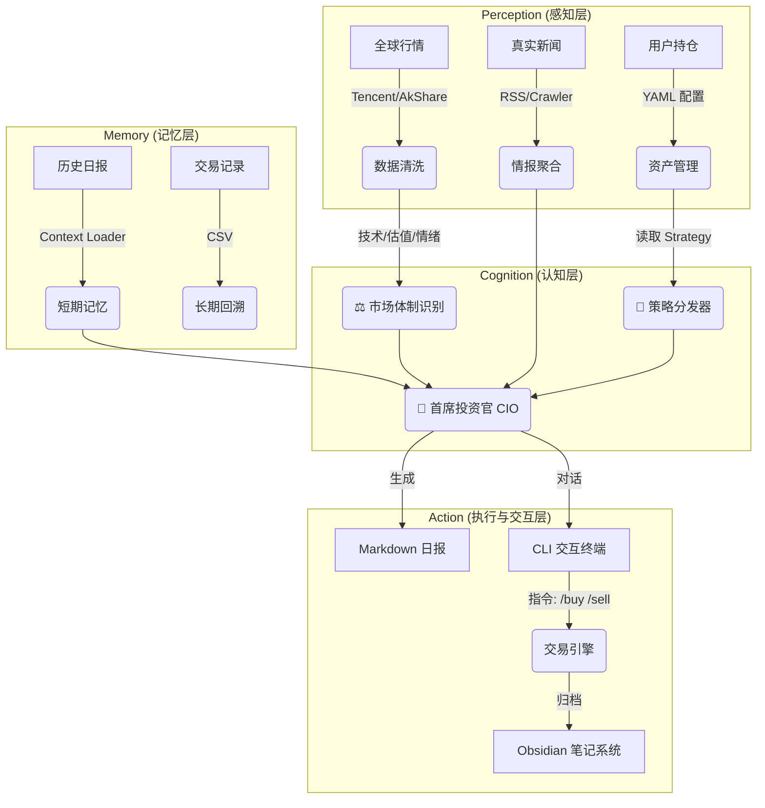

# 🚀 Agentic Investment OS (V1.0)

> "An AI Investment Advisor with Memory, Intent-Awareness, and Execution Capability."

## 📖 项目简介

**Agentic Investment OS** 是一个高度私人化的智能投资辅助系统。与传统的量化脚本或通用 AI 聊天机器人不同，本系统具备 **“长期记忆 (Memory)”**、**“意图感知 (Intent-Aware)”** 和 **“闭环执行 (Execution)”** 能力。

它不仅能分析全球市场，还能根据你对不同资产设定的战略（如“长线定投”或“短线博弈”），结合当前的市场体制（牛/熊/震荡），给出个性化的操作建议，并自动记录交易到 Obsidian 知识库。

## 🏗️ 系统架构



## 🌟 核心特性 (V1.0)

1.  **意图感知与体制识别**
    *   区分“定投”与“波段”策略，在牛/熊不同体制下给出差异化建议。
    *   *实战*：低估值+定投策略+技术破位 = **买入机会**（而非止损）。

2.  **全维数据感知**
    *   **真实数据**：集成腾讯财经（行情）、乐咕乐股（估值）、RSS（新闻）。
    *   **深度指标**：集成 MA, RSI, MACD, **布林带**, **量比**, **KDJ**, **ATR**。

3.  **记忆与交互系统**
    *   **Context Aware**：AI 记得过去 3 天的建议，避免观点跳跃。
    *   **Chat & Trade**：在终端通过 CLI 与 AI 对话，发送 `/buy` 指令自动记账并更新持仓。

4.  **Obsidian 深度集成**
    *   日报自动归档至 `Dashboard`。
    *   交易指令自动生成交易单至 `Trade_Journal`。

## 🛠️ 目录结构

```text
Agentic-Investment-OS/
├── config/
│   ├── portfolio.yaml      # [核心] 持仓、策略与资金配置
│   └── settings.yaml       # API Key 与 Obsidian 路径配置
├── data/                   # 本地持久化数据
│   └── trade_history.csv   # 交易流水
├── reports/                # 生成的 Markdown 日报缓存
├── src/
│   ├── core/               # [大脑]
│   │   ├── advisor.py      # LLM 交互、Prompt 与 CLI 聊天
│   │   ├── memory.py       # [New] 上下文记忆加载器
│   │   └── regime.py       # 市场体制判断逻辑
│   ├── tools/              # [手脚]
│   │   ├── market_data.py  # 全球行情与技术指标
│   │   ├── news_hub.py     # RSS 新闻聚合
│   │   ├── valuation.py    # PE/PB 估值锚点
│   │   ├── transaction.py  # [New] 交易指令与自动记账
│   │   └── portfolio_mgr.py# 资产计算
│   └── utils/              # 辅助工具 (Obsidian Sync 等)
├── main.py                 # 启动入口
└── requirements.txt
```

## 🚀 快速开始

1.  **配置环境**: `pip install -r requirements.txt`
2.  **配置资产**: 修改 `config/portfolio.yaml`，填入持仓与策略标签。
3.  **运行**: `python main.py`
4.  **交互**:
    *   阅读生成的日报。
    *   在终端输入问题追问逻辑。
    *   输入 `/buy [code] [shares] [price]` 执行交易。

## 📄 License
MIT
```
