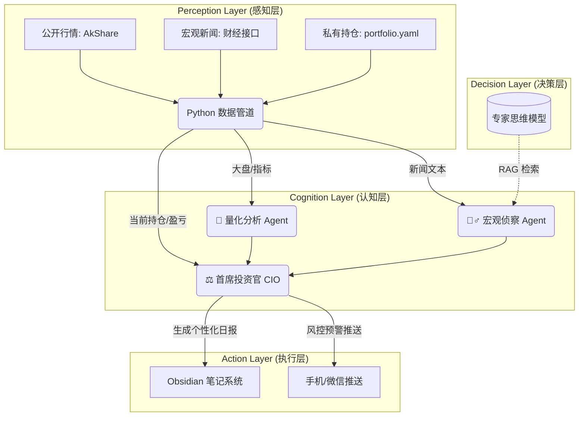

# 🚀 Agentic Investment OS (AI 投资辅助系统)

> "Invest in logic, not just intuition."

## 📖 项目简介

**Agentic Investment OS** 是一个基于 **LLM (大语言模型)** 与 **Python 量化数据** 的自动化投资辅助系统。它旨在通过多智能体协作（Multi-Agent Collaboration），结合权威宏观信息与实时市场数据，并根据用户真实持仓数据，为个人投资者提供理性、可回溯的投资决策支持。

本项目采用 **“感知-认知-决策”** 分层架构，模拟专业投资委员会的运作流程。

## 🏗️ 系统架构



项目结构如下所示：

```text
Agentic-Investment-OS/
├── config/                 # [配置] 存放 API Key 和 参数设置
│   ├── settings.yaml       # (新建文件，稍后填)
|   └── portfolio.yaml      # [数据] 个人持仓配置文件
├── data/                   # [数据] 存放本地缓存的 CSV/数据库
│   └── raw/                # 原始数据
├── logs/                   # [日志] 存放运行日志
├── reports/                # [输出] 存放生成的 Markdown 报告 (将软链接到你的 Obsidian)
├── src/                    # [源代码] 核心逻辑
│   ├── __init__.py
│   ├── agents/             # [智能体] 存放 Prompt 和 Agent 类
│   │   ├── __init__.py
│   │   ├── scout.py        # 宏观侦察员
│   │   └── quant.py        # 量化分析师
│   ├── tools/              # [工具箱] 存放 AkShare 封装函数
│   │   ├── __init__.py
|   |   ├── portfolio_mgr.py# 负责读取并计算持仓盈亏、占比的模块
│   │   └── market_data.py  # 数据获取接口
│   └── utils/              # [工具类] 文件读写、通知推送
│       ├── __init__.py
│       └── file_handler.py
├── .gitignore              # git 忽略文件
├── main.py                 # [入口] 主程序
├── requirements.txt        # 依赖库
├── README.md               # 项目说明书
└── TODO.md                 # 开发计划
```

## 🛠️ 技术栈

- 核心语言: Python 3.9
- 大模型支持: OpenAI / DeepSeek / Claude (via API)
- 数据源: AkShare (开源财经数据接口)
- 知识库/前端: Obsidian (Markdown + Dataview)
- 调度: GitHub Actions / Local Cron


## 🚀 快速开始

1. 克隆仓库
2. 安装依赖: pip install -r requirements.txt
3. 配置 config/settings.yaml (填入 API Key)
4. 运行: python main.py

## 📄 License

MIT